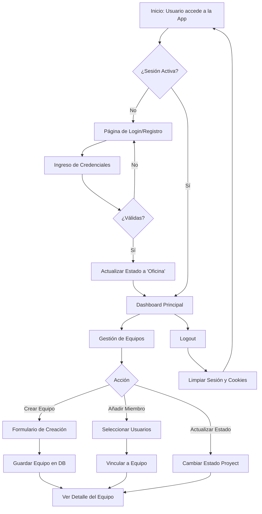

<p align="center">
  
</p>

<h1 align="center">TeamHub</h1>

<p align="center">
  <strong>Gestión de proyectos y colaboración de equipos de alto rendimiento.</strong>
</p>

<p align="center">
  
  
  
  
</p>

---

## 🌟 Descripción General

**TeamHub** es una plataforma de vanguardia diseñada para centralizar la gestión de proyectos y potenciar la colaboración en equipos modernos. Con un enfoque en la experiencia de usuario y un diseño _Dark Mode_ premium, TeamHub ofrece herramientas intuitivas para el seguimiento de tareas, la gestión de estados y la monitorización de la disponibilidad del equipo en tiempo real.


---

## 🔄 Flujos del Sistema

A continuación se muestra el diagrama de flujo principal que describe el proceso de autenticación y gestión de equipos dentro de la plataforma:



---

## ✨ Características Principales

- 🚀 **Gestión de Proyectos Intuitiva**: Control total sobre el ciclo de vida de los proyectos con estados dinámicos (_En Progreso, Completado, Pausado, Cancelado_).
- 👥 **Colaboración en Tiempo Real**: Visualización dinámica de la presencia de los miembros del equipo (Conectado, Ausente, Desconectado) con actualizaciones automáticas.
- 🔐 **Sistema de Roles Robusto**:
  - **Admin**: Administración global, gestión de usuarios y configuración del sistema.
  - **Manager / Jefe de Proyecto**: Creación de equipos, asignación de miembros y control estratégico.
  - **Trabajador**: Acceso a proyectos asignados y herramientas de colaboración enfocadas.
- 🎨 **Interfaz Premium**: Diseño moderno optimizado para la productividad, con transiciones fluidas y una estética profesional.
- 🔗 **Integración con GitHub**: Vinculación directa de repositorios a equipos para un seguimiento técnico centralizado.

---

## 🛠️ Stack Tecnológico

El proyecto utiliza un stack moderno y eficiente diseñado para la escalabilidad:

- **Backend**: PHP 8.2 (Estructura MVC limpia).
- **Base de Datos**: MySQL 8.0 con optimización de relaciones.
- **Contenedores**: Docker & Docker Compose para un entorno de desarrollo reproducible.
- **Servidor**: Apache 2.4 con configuración de rutas amigables (`mod_rewrite`).
- **Frontend**: JavaScript Vanilla (ES6+), AJAX para reactividad y CSS3 Moderno con variables personalizadas.

---

## 📂 Estructura del Proyecto

Organización siguiendo el patrón MVC y mejores prácticas de desarrollo:

```bash
TeamHub/
├── app/
│   ├── Controllers/    # Lógica de las peticiones (Auth, Team, User, etc.)
│   ├── Models/         # Interacción con la base de datos
│   ├── Views/          # Plantillas de interfaz (Páginas y Layouts)
│   ├── Middleware/     # Control de acceso y sesiones
│   └── Services/       # Funcionalidades transversales
├── config/             # Configuración de base de datos y constantes globales
├── public/             # Raíz pública (index.php, CSS, JS, Assets)
├── tests/              # Pruebas automatizadas del sistema
├── docker-compose.yml  # Definición de infraestructura
└── install.sql         # Script de inicialización de la base de datos
```

---

## 🚀 Instalación Rápida

Sigue estos pasos para desplegar **TeamHub** en tu entorno local:

1.  **Clonar el repositorio**:

    ```bash
    git clone https://github.com/JaimeRamirezNavarro/TeamHub.git
    cd TeamHub
    ```

2.  **Configurar el entorno**:
    Copia el archivo de ejemplo y ajusta los parámetros si es necesario:

    ```bash
    cp config/db_config.example.php config/db_config.php
    ```

3.  **Iniciar con Docker**:
    Levanta los contenedores (PHP, Apache, MySQL, phpMyAdmin):

    ```bash
    docker-compose up -d
    ```

4.  **Acceder a la plataforma**:
    - **Aplicación**: [http://localhost:8080](http://localhost:8080)
    - **Administración BD**: [http://localhost:8081](http://localhost:8081)
    - **Base de Datos Directa**: Puerto `3306` (Usuario: `root`, Pass: `root`)

---

## 🤝 Contribución

¡Las contribuciones son bienvenidas! Si deseas mejorar TeamHub:

1. Realiza un **Fork** del proyecto.
2. Crea una rama para tu funcionalidad (`git checkout -b feature/NuevaFuncionalidad`).
3. Realiza tus cambios y haz **Commit** (`git commit -m 'Añade NuevaFuncionalidad'`).
4. Haz **Push** a la rama (`git push origin feature/NuevaFuncionalidad`).
5. Abre un **Pull Request**.

---

<p align="center">
  Desarrollado con precisión por <strong>Jaime Ramírez Navarro y equipo</strong> para potenciar la colaboración global.
</p>
